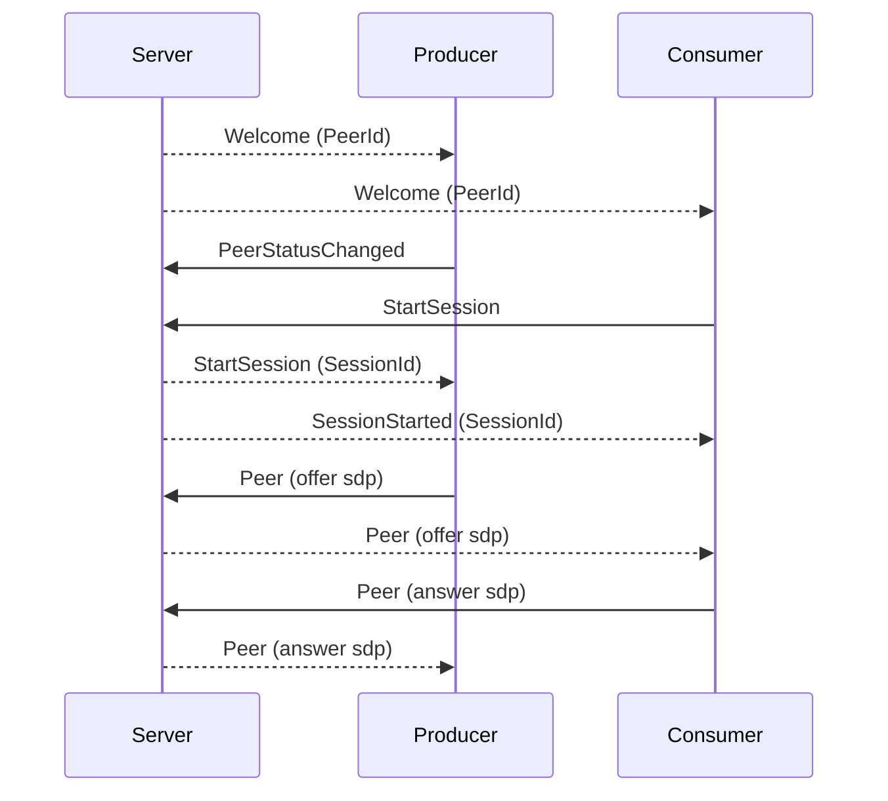

# gst-signalling-py: Gstreamer WebRTC signalling in Python

[](https://github.com/psf/black)   

This repository provides a Python implementation of the [Gstreamer WebRTC signalling](https://gitlab.freedesktop.org/gstreamer/gst-plugins-rs/-/tree/main/net/webrtc) protocol. 

It provides an API close to the gstreamer API with a [producer](./src/gst_signalling/gst_producer.py) and a [consumer](./src/gst_signalling/gst_consumer.py). This allows to simply write producer/consumer examples using gstreamer signalling. It works with single producer and multiple consumers for exchanging data. See the [data producer example](./src/example/datachannel-single-producer-multiple-consumer/) for more details.

It also provides tools to list and monitor the peers connected to a signalling server.

_Note that there is no example of audiovideo streaming. Gstreamer provides [rust plugins](https://gitlab.freedesktop.org/gstreamer/gst-plugins-rs) that directly communicate with a signalling server_

## Installation

Simply install the package using pip:

```bash
pip install -e .
```

## Usage

See the [examples](src/example/) for more details.

## Protocol

### Roles

Gstreamer signalling defines 3 roles (so the WebRTC peers are not symmetrical)

- producer (produces data, video or audio streams)
- consumer (access to a producer stream, can access all or a subset of its streams)
- listener (gets notified by the server of new producers status)

### Protocol sequence diagram



See [this page](https://pollen-robotics.notion.site/Gstreamer-WebRTC-signaling-8cc2391ef0004ef6b399095ea507121f?pvs=4) for more details.


## Contribute

Please refer to our [template repository](https://github.com/pollen-robotics/python-template) for guidlines and coding style.

Development tools can be installed with

```bash
pip install -e .[dev]
```

### Unit tests

The [gstreamer signalling server](https://gitlab.freedesktop.org/gstreamer/gst-plugins-rs/-/tree/main/net/webrtc/) is required to run on the localhost. Then run

```bash
pytest
```